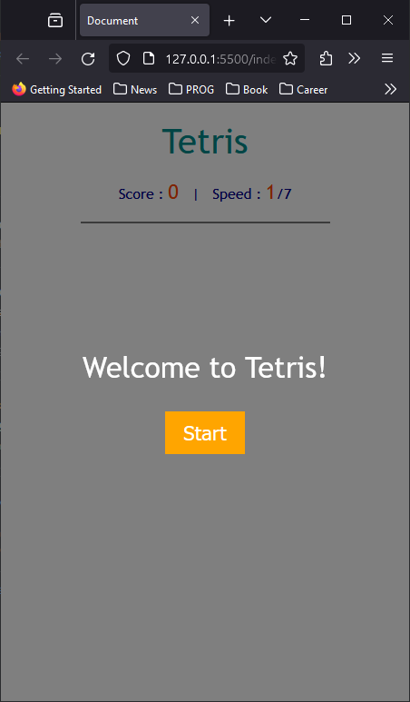
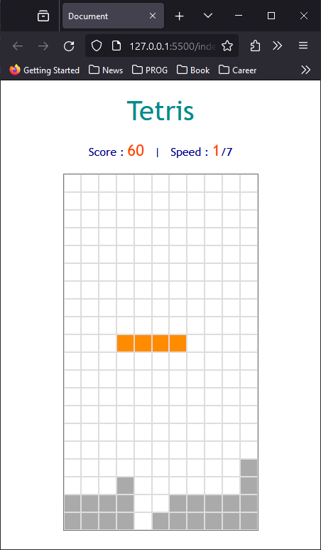
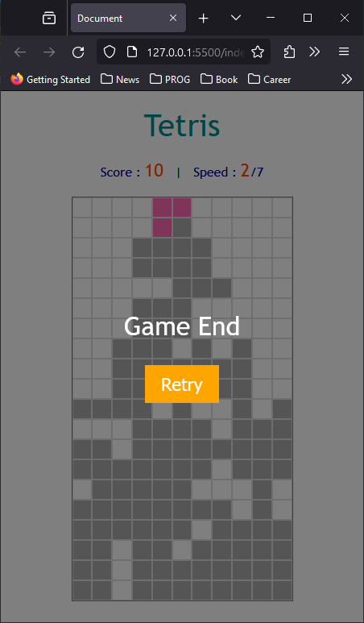

# Tetris Game App

## App Intro

- Tetris Game
- coded with Vanila Javascript, CSS, HTML
- Edited with Visual Studio Code

## How to start

- double click the 'index.html' file to open with your brower

## Basic Control

- Left arrow : move left
- Right arrow : move right
- Up arrow : rotate shape
- Down arrow : move down a bit faster
- Space bar : drop to the bottom
- ESC : pause game

## Others

- Game speed up 7 levels : per every 60 seconds

## UI Previews

- to start the game, just press 'start' button

- just control with arrow keys

- If you failed, the game would end with 'retry' button

## Ref

- www.youtube.com/watch?v=1lNy2mhvLFk&list=PLpJDjPqxGWGrSGPUBqWlsJlcLF_grNClK&index=10
